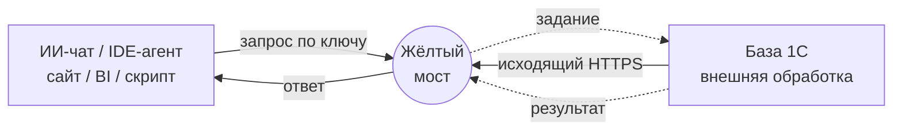

# Жёлтый мост

**Данные из 1С - там, где они нужны**

Сервис соединяет базы 1С с ИИ-ассистентами, сайтами, аналитикой и внешними системами.
Без публикации базы в интернет, без доработки конфигурации и без белого IP:
обработка внутри базы сама забирает задания и возвращает результат.

[**Сайт сервиса**](https://onecdatalink.ru/?utm_source=github&utm_medium=readme) ·
[**Тарифы**](https://onecdatalink.ru/price.html?utm_source=github&utm_medium=readme) ·
[**Начать бесплатно**](https://app.onecdatalink.ru/login) ·
[**Видео с настройкой на RuTube**](https://rutube.ru/channel/80249585/)

Статья о сервисе на Инфостарте:
[ИИ + 1С без лишних хлопот: решения для тех, кому нужно просто спросить базу текстом](https://infostart.ru/public/2754157/)

---

В этом репозитории - **клиентская часть**: внешняя обработка, которая ставится
в вашу базу и работает в вашем контуре. Серверная часть сервиса закрыта, ее тут
нет и не будет. В репозитории всегда одна, актуальная версия сборок.

## Как это работает

Входящих соединений в базу нет, инициатор всегда база: обработка опрашивает
сервис исходящим HTTPS, забирает задание, выполняет его внутри базы и тем же
соединением возвращает результат. На практике это значит: не нужен внешний IP,
не нужна публикация веб-сервисов, не нужен VPN и не нужно просить
администратора открыть порт. Медиана времени от запроса потребителя до ответа
из базы - около 1,4 секунды.

От регистрации до первых данных - обычно меньше получаса:

1. **Регистрация** - вход по почте без пароля, пробные сутки начисляются сразу:
   [app.onecdatalink.ru](https://app.onecdatalink.ru/login);
2. **Ключ на базу** - режим «только чтение» или «чтение и запись» задается ключом;
3. **Обработка** - скачать из этого репозитория, открыть в базе, вставить ключ, нажать «Старт»;
4. **Обмен** - спрашивайте ИИ обычными словами: «покажи остатки», «выгрузи заказы за неделю».

## Скачать обработку

Сборки функционально одинаковы - выбирайте по своей платформе:

| Файл | Для чего |
|---|---|
| `onecdatalink_v0.9.28 (управляемые формы, УТ 11.4, УТ 11.5, УНФ, КА 2, ERP 2).epf` | управляемые формы, платформа 8.3.6 и новее: УТ 11.4 и 11.5, УНФ, КА 2, ERP 2, БП 3. **Большинству нужна именно она** |
| `onecdatalink_v0.9.28 (старые платформы 8.3.5, УТ 11.1).epf` | старые платформы 8.3.5.x, например УТ 11.1, прямое подключение |
| `onecdatalink_v0.9.28 (старые платформы 8.3.5, УТ 11.1, через прокси).epf` | то же для старых Windows без TLS 1.2: рядом ставится локальный прокси |
| `onecdatalink_v0.9.28 (обычные формы, УПП 1.3, УТ 10.3, КА 1.1).epf` | обычное приложение: УПП 1.3, УТ 10.3, КА 1.1. Обмен идёт из открытой формы |
| `onecdatalink_v0.9.28 (обычные формы, УПП 1.3, УТ 10.3, КА 1.1, через прокси).epf` | обычное приложение на старых Windows без TLS 1.2, через локальный прокси |
| `stunnel-onecdatalink.conf` | готовый конфиг stunnel для вариантов с прокси |
| `onecdatalink_proxy.py` | наш локальный прокси, альтернатива stunnel (исходник) |
| `isrgrootx1.pem` | корневой сертификат Let's Encrypt: по нему прокси проверяет, что соединился именно с нашим сервером |

В сборках для старых 1С заменены вызовы, которых нет на 8.3.5: объекты JSON,
`СтрРазделить`, `СтрШаблон`, `СтрСоединить`, `СтрНайти`,
`ПолучитьHexСтрокуИзДвоичныхДанных`, объектный HTTP-API. Вместо последнего
работает файловый API `ОтправитьДляОбработки`, вместо JSON - свой парсер.

## Кому это

Разверните свою специальность - внутри короткий сценарий и ссылка на подробные кейсы.

<b>1С-программисту</b> - диагностика чужих баз без RDP, ИИ-консоль запросов, проверка кода

Ключ уже стоит у клиента - и «остатки уехали после обмена» разбирается вопросом
ИИ в чате, без RDP и ожидания доступов. Шлюз работает как консоль запросов,
где текст запроса пишет ИИ и отлаживает его на живых данных - готовый запрос
забираете в модуль. Код проверяется валидатором под старые платформы до
выкатки, массовые правки идут скриптом с пробным прогоном и откатом.

[Кейсы для программиста](https://onecdatalink.ru/dlya/1c-programmist.html?utm_source=github&utm_medium=readme)

<b>1С-консультанту</b> - аудит базы перед внедрением за один вечер

До коммерческого предложения: ключ «только чтение» - и ИИ считает дубли
справочников, зависшие документы, отрицательные остатки и самописные объекты.
Смета защищается цифрами из базы самого клиента, а не ощущениями.

[Кейсы для консультанта](https://onecdatalink.ru/dlya/1c-konsultant.html?utm_source=github&utm_medium=readme)

<b>Бухгалтеру</b> - «почему не сходится НДС» без программиста

Вопросы к базе обычными словами: ИИ сам находит документы, проведенные без
НДС, показывает остатки без выгрузок и делает сверку перед отчетностью.
Для аутсорсеров - чек-лист закрытия месяца по всем базам клиентов из одного чата.

[Кейсы для бухгалтера](https://onecdatalink.ru/dlya/buhgalter.html?utm_source=github&utm_medium=readme) ·
[для аутсорсера](https://onecdatalink.ru/dlya/buhgalter-autsorser.html?utm_source=github&utm_medium=readme)

<b>Руководителю и собственнику</b> - цифры компании в телефоне, без посредников

«Выручка вчера по точкам», «остаток на счетах», «дебиторка топ-10» - три
сообщения с телефона по дороге в офис. Собственнику - личный ключ и цифры без
фильтра чужих рук: никто не готовит данные «к показу».

[Кейсы для руководителя](https://onecdatalink.ru/dlya/rukovoditel.html?utm_source=github&utm_medium=readme) ·
[для собственника](https://onecdatalink.ru/dlya/sobstvennik.html?utm_source=github&utm_medium=readme)

<b>Аналитику</b> - выгрузки и срезы без очереди к программисту

ABC-анализ за обед, когорты прямо запросом к базе, регулярные выгрузки в BI
по расписанию через API - без промежуточных файлов и ночных обменов.

[Кейсы для аналитика](https://onecdatalink.ru/dlya/analitik.html?utm_source=github&utm_medium=readme)

<b>ИТ-директору</b> - управляемый канал вместо теневого ИИ

Сотрудники уже копируют данные из 1С в личные чат-боты. Здесь у каждого свой
ключ, персональные данные маскируются до отправки, каждый запрос в журнале,
ключ гасится одной галкой. База при этом закрыта наружу: только исходящие
соединения.

[Кейсы для ИТ-директора](https://onecdatalink.ru/dlya/it-direktor.html?utm_source=github&utm_medium=readme)

<b>Аудитору и налоговому консультанту</b> - сплошная проверка вместо выборки

ИИ прогоняет все проводки за год: нетиповые корреспонденции, ручные операции,
проводки задним числом. Карта налоговых рисков собирается по живой базе со
ссылками на конкретные документы.

[Кейсы для аудитора](https://onecdatalink.ru/dlya/auditor.html?utm_source=github&utm_medium=readme) ·
[для налогового консультанта](https://onecdatalink.ru/dlya/nalogovyi-konsultant.html?utm_source=github&utm_medium=readme)

<b>Специалисту по Битрикс24</b> - данные 1С в портале без публикации базы

Вебхук дергает REST сервиса - в карточке сделки живые остатки, цены и долги из
1С. Роботы проверяют долг контрагента перед сменой стадии. Конфигурация 1С не
тронута, база наружу не опубликована.

[Кейсы для Битрикс24](https://onecdatalink.ru/dlya/bitrix24.html?utm_source=github&utm_medium=readme)

## Безопасность коротко

- **База закрыта наружу**: только исходящий HTTPS, входящих соединений нет.
- **Права задает ключ**: «только чтение» физически не может менять данные -
  проверка стоит и на сервере, и в обработке.
- **Запись - с пробным прогоном**: по умолчанию транзакция откатывается,
  изменения применяются только после явного подтверждения.
- **Персональные данные можно маскировать** на стороне базы: наружу уходят
  коды вместо имен и телефонов.
- **Каждое обращение - в журнале** кабинета: кто, когда, что спросил.
- Токен хранится в `ХранилищеОбщихНастроек`, в тексте обработки его нет.

Подробнее о механизмах - ниже, в разделе про чтение и запись.

## Установка (платформа 8.3.6 и новее)

1. «Файл» - «Открыть», выбрать `onecdatalink_v0.9.28 (управляемые формы, УТ 11.4, УТ 11.5, УНФ, КА 2, ERP 2).epf`. Или добавить в
   «Дополнительные отчеты и обработки», если конфигурация на БСП.
2. Нажать «Проверить / заменить токен», вставить ключ из личного кабинета.
3. Нажать «Старт».

Кнопка «Удалить токен» очищает ключ в этой базе: значение настройки обнуляется,
сама запись хранилища не трогается. Обмен при этом останавливается, а ключ
остаётся в личном кабинете - его можно вписать снова.

Токен хранится в `ХранилищеОбщихНастроек` под ключом `onecdatalink`, в тексте
обработки его нет. Ключ хранилища не зависит от имени объекта, поэтому при
замене сборки вводить токен заново не нужно.

Конфигурация не меняется, с поддержки снимать ничего не требуется.

<b>Старые 1С: платформа 8.3.5</b>

Сервис принимает только TLS 1.2 и новее. Какая сборка подойдет, зависит не от
конфигурации, а от того, откуда возьмется TLS:

**Windows 8.1 / Server 2012 R2 и новее.** Берите
`onecdatalink_v0.9.28 (старые платформы 8.3.5, УТ 11.1).epf` - она подключается напрямую,
TLS дает сама Windows. Установка та же: открыть, вставить ключ, «Старт».

**Старые Windows (7, Server 2008/2008 R2 и старше).** Ни платформа 8.3.5, ни
такая Windows не умеют TLS 1.2, напрямую соединение не установится. Решение -
локальный прокси на той же машине: обработка ходит на `http://127.0.0.1:8080`
(только внутри машины, наружу это не выходит), прокси шифрует трафик
современным TLS и передает сервису. Для этого варианта берите сборку
`onecdatalink_v0.9.28 (старые платформы 8.3.5, УТ 11.1, через прокси).epf` - в ней вшит адрес
`http://127.0.0.1:8080`.

Прокси - любой из двух, оба конфига в репозитории:

*Вариант А, stunnel.* Известная программа с собственным современным OpenSSL.

1. Скачайте stunnel для Windows с [stunnel.org](https://www.stunnel.org/downloads.html)
   и установите.
2. Положите `stunnel-onecdatalink.conf` из этого репозитория в папку
   конфигурации stunnel (или допишите секцию `[onecdatalink]` в существующий
   конфиг), а рядом со `stunnel.exe` - `isrgrootx1.pem` из этого же
   репозитория. По этому файлу stunnel проверяет сертификат сервера: без
   проверки канал шифруется, но подмену сервера распознать нельзя.
3. Запустите stunnel (лучше службой: в GUI меню «Service - Install»).
4. Откройте в 1С прокси-сборку, вставьте ключ, «Старт».

*Вариант Б, наш прокси* `onecdatalink_proxy.py`. Написан специально под
файловый HTTP-клиент старых 1С: если stunnel в вашем окружении дает ошибку
вида «Server returned nothing», используйте его. Нужен Python 3.8 на машине
(последняя версия под Windows 7 / Server 2008 R2):
`python onecdatalink_proxy.py` - прокси слушает 127.0.0.1:8080, лог пишет
рядом. Готовый exe без установки Python вышлет поддержка:
support@onecdatalink.ru.

Токен при этом ходит открыто только внутри машины (127.0.0.1), наружу трафик
всегда идет по TLS.

<b>Обычное приложение: УПП 1.3, УТ 10.3, КА 1.1</b>

Конфигурации на обычных формах (режим совместимости 8.2.x) не открывают
управляемую форму, поэтому для них есть отдельная сборка -
`onecdatalink_v0.9.28 (обычные формы, УПП 1.3, УТ 10.3, КА 1.1).epf`. Внутри тот же обмен, разница только
в интерфейсе и в наборе функций языка (там нет JSON-объектов и строковых
функций 8.3.6+, вместо них свои).

Установка: «Файл» - «Открыть», выбрать файл, «Заменить токен», вставить ключ,
«Проверить соединение», затем «Старт». Обмен идёт, пока форма открыта.

Если платформа на старой Windows без TLS 1.2 - берите вариант
`..._обычные_формы_прокси.epf` и поднимайте локальный прокси (см. раздел выше).

Регламентным заданием такую обработку вызвать нельзя: задание умеет запускать
только методы общих модулей конфигурации. Варианты для фонового обмена -
держать форму открытой в отдельном сеансе либо добавить в конфигурацию
общий модуль-обёртку; за вторым вариантом напишите в поддержку.

<b>Работа без открытой формы и несколько обменов</b>

Форма нужна для ввода ключа и ручного запуска. Постоянный обмен правильнее
вешать на регламентное задание: в конфигурациях на БСП обработку можно
зарегистрировать в «Дополнительных отчетах и обработках» с видом
«Регламентное задание».

Бюджет одного цикла - 110 секунд, поэтому расписание раз в две минуты ложится
без разрывов.

В клиент-серверном варианте регламентное задание идет в фоновом сеансе и
клиентскую лицензию не расходует. В файловом варианте фоновых сеансов нет,
нужен запущенный сеанс, и он занимает лицензию. Число потребителей на лицензии
не влияет: все команды исполняются в одном сеансе обработки.

Если на старой базе очередь дополнительных обработок не выполняется (бывает),
напишите в поддержку - есть вариант установки общим модулем с нативным
регламентным заданием.

**Один обмен или несколько.** Каждый запуск обмена регистрируется как отдельный
агент. Поэтому ручной запуск и регламентное задание не перехватывают сессию
друг у друга, а несколько одновременно запущенных обменов на одной базе делят
очередь команд между собой. Если одного обмена не хватает по нагрузке,
запустите второй.

Обработка присылает сервису отпечаток строки соединения: по нему второй обмен
на той же базе отличается от подключения другой базы тем же ключом.

## Что обработка позволяет делать с базой

Права определяет ключ, а не сборка. Сервер не выдает команды записи по ключу,
у которого режим «только чтение», а обработка дополнительно проверяет то, что
пришло.

**Чтение** (`run_query`). Выполняется запрос на языке запросов 1С. Перед
выполнением текст проверяется процедурой `ПроверитьReadOnly`: вырезаются
строковые литералы и комментарии, затем ищутся изменяющие конструкции. Язык
запросов доступен целиком - пакеты, `ПОМЕСТИТЬ` и `УНИЧТОЖИТЬ`, соединения,
`ИТОГИ`, виртуальные таблицы регистров.

Замечание по существу: язык запросов 1С и так только на выборку, DML в нем
нет. Эта проверка - второй рубеж и понятная ошибка вместо платформенной. Такая
же проверка стоит на сервере, потому что обработка находится на стороне
клиента и доверять ей нельзя.

**Запись** (`run_script`). Выполняется код на встроенном языке. Три ограничения
работают одновременно:

- `УстановитьБезопасныйРежим(Истина)` - без файловой системы, COM и запуска
  программ;
- код идет в транзакции, и по умолчанию `dry_run`, то есть транзакция
  откатывается;
- ключу можно закрепить откат на стороне сервиса - тогда `dry_run` не
  отключается ничем, что придет в запросе.

Ответ всегда содержит фактическое состояние: `dry_run`, `rolled_back`,
`committed`, `safe_mode`.

<b>Честные оговорки: пробный прогон и стоимость чтения</b>

Что важно понимать про пробный прогон: откат возвращает ДАННЫЕ, но не отменяет
всего остального. Пока код выполняется, транзакция держит блокировки на всем,
что он тронул, и другие сеансы ждут ее так же, как ждали бы настоящую запись.
Записи, которые платформа успела сделать в журнал регистрации, откатом тоже не
снимаются. То есть «ничего не изменилось» и «ничего не произошло» - разные
вещи, и на боевой базе разница чувствуется.

Про чтение стоит сказать честно тоже: запрос ничего не меняет, но стоит
времени. Тяжелое соединение регистров без отборов нагружает сервер 1С
независимо от того, сколько строк вы просите. Сервис отсекает выборку сверху,
если знает нужное число строк, отдает результат порциями и ограничивает размер
ответа.

Отсечение - мера «по возможности», а не гарантия. Она не применяется там, где
изменила бы смысл запроса: `ИТОГИ`, `ОБЪЕДИНИТЬ`, запись во временную таблицу в
итоговом запросе. Не ограничивает она и стоимость вычислений: тяжелое
соединение или неудачный отбор остаются тяжелыми, сколько бы строк вы ни
попросили. Смещение при постраничном чтении ограничено сверху; для глубоких
выборок правильнее отбирать по последнему прочитанному ключу, а не листать.

## Диагностика

По умолчанию обработка не пишет в журнал регистрации: причина ошибки видна в
кабинете сервиса, а журнал базы засорять незачем. Если нужно писать - функция
`ЗаписыватьОшибкиВЖурнал` в модуле объекта, вернуть `Истина`.

Форма показывает счетчики шагов, команд и ошибок и последние события.

## Требования

- Платформа 1С:Предприятие 8.3.5 и новее.
- Исходящий HTTPS на `api.onecdatalink.ru` с машины, где выполняется обработка
  (для старых Windows - через локальный прокси, см. выше).
- Ключ подключения из личного кабинета.

## Обратная связь

Вопросы по установке и работе обработки - в issues или на
support@onecdatalink.ru.

Сам сервис, тарифы и регистрация -
[onecdatalink.ru](https://onecdatalink.ru/?utm_source=github&utm_medium=readme).

Видео с настройкой (ChatGPT, Claude, IDE-агент) и живыми примерами -
[канал на RuTube](https://rutube.ru/channel/80249585/).
